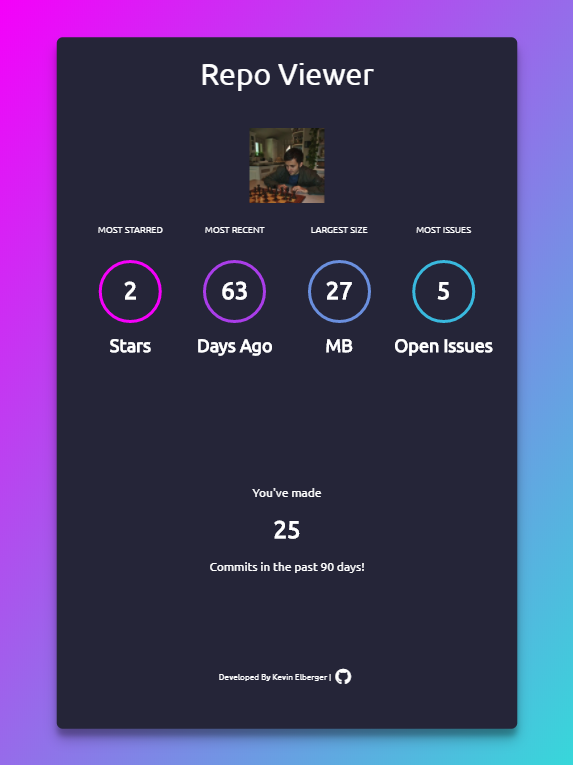

# repo-viewer

>A web application that generates statistics for Github profiles

<p align="center">
    
</p>

## Build Setup

``` bash
# install dependencies
npm install

# serve with hot reload at localhost:3000
npm start

```